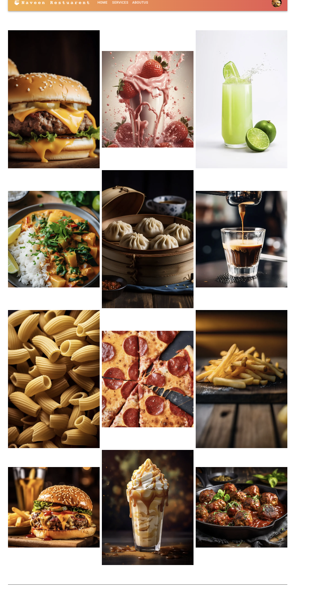
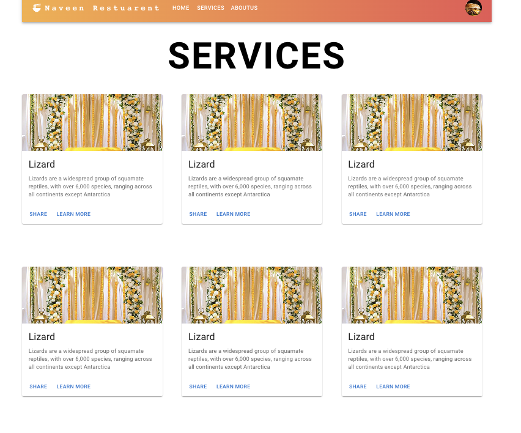
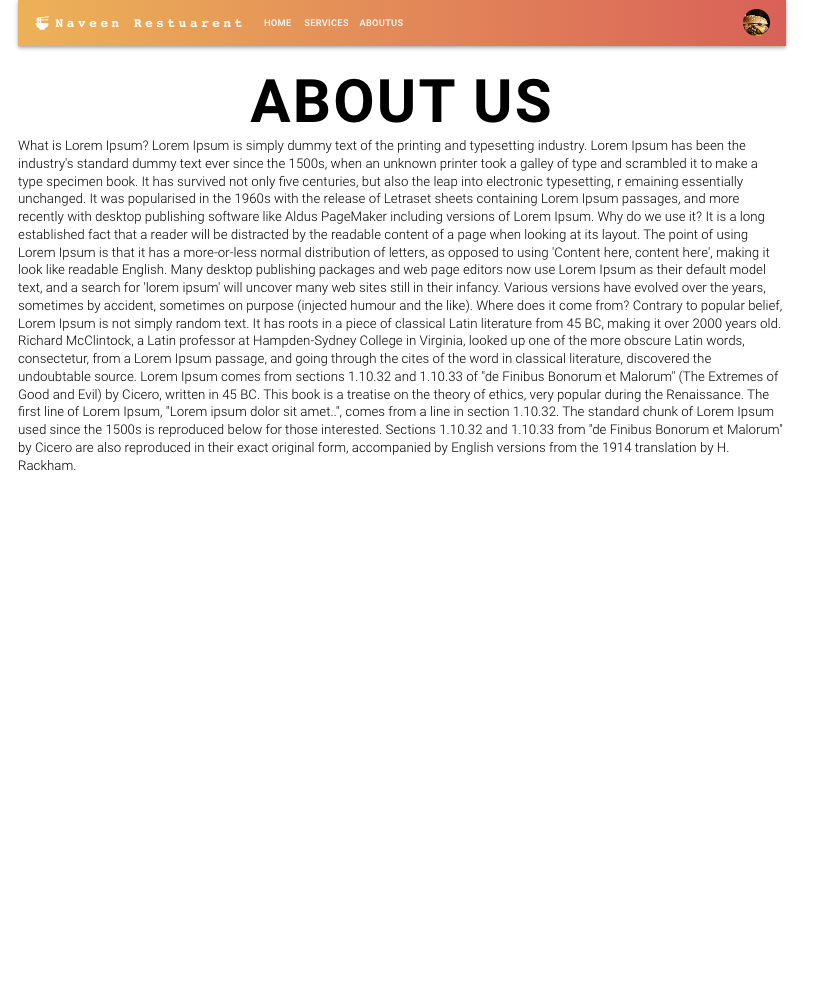

# My React Project with Material-UI, Redux Toolkit and Docker Setup  🚀🚀🚀🚀

Welcome to my React project! This project showcases a React application built with Material-UI and comes with a Docker setup for easy development and deployment.

## Prerequisites

To get started, make sure you have the following installed on your machine:

- [Docker](https://www.docker.com/products/docker-desktop)

## Description

This project is designed to showcase the use of Material-UI components in creating a wedding facilities website. It provides a simple layout with various components from the Material-UI library to demonstrate how to build a responsive and visually appealing interface.
Docker 

## Technologies Used

- React: A JavaScript library for building user interfaces.
- Material-UI: A popular React UI framework that follows Google's Material Design guidelines.
- Redux Toolkit: A state management library for React applications.
- React Router DOM: A library for client-side routing in React applications.
- Docker
## Getting Started

1. Clone this repository to your local machine:

   ```bash
   git clone https://github.com/your-username/your-repo.git
   cd your-repo
   
**Install Dependencies:**

After cloning the repository, navigate to the project directory and install the project's dependencies using npm:
npm install

**Docker Setup**
Build and Run Docker Containers:

Use Docker Compose to build and run the Docker containers:

docker-compose up -d

Wait for a few minutes:

The first time you run the Docker containers, it might take a few minutes for everything to set up, especially if dependencies need to be downloaded.

Access the React App:

Once the containers are up and running, you can access the React app in your browser by navigating to http://localhost:3000.

**Development Workflow**

Edit your React app code in the src directory.
Changes will be reflected in real-time as you save your files, thanks to hot-reloading.
Experiment with Material-UI components and styles to customize your app's look and feel.

**Contributing**

Contributions are welcome! If you find any issues or want to add features or improvements, feel free to create pull requests.

**Screen**




Happy coding! 🚀🚀🚀🚀🚀🚀🚀


